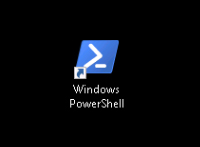
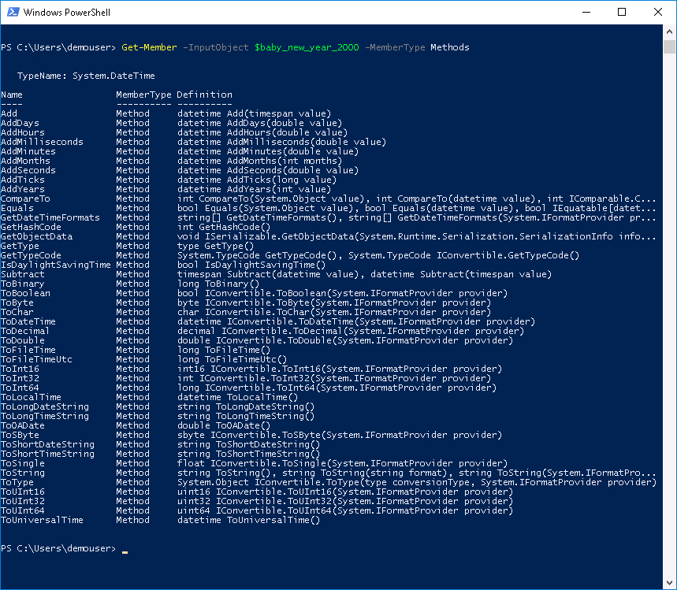

# PowerShell Cmdlets and Objects

This lab is a all about PowerShell Cmdlets and Objects.

## Objectives

Completion time: 20 minutes

  - What is a PowerShell Cmdlet
  - How to Get-Help for a Cmdlet
  - What is a PowerShell Object
  - Why Objects are Awesome

## Prerequisites

It would be great if you have gone through the <strong>PowerShell Introduction</strong> Lab. You'll need a Windows Desktop with PowerShell installed. While it is true that PowerShell will run on Linux and macOS we will not be doing any of that in this lab.

## Product

PowerShell is made by Microsoft, the source code is available on [github](https://github.com/powershell/powershell) and open to community contributions.

The items covered in this lab and other PowerShell focused labs are greatly influenced by this [PowerShell Scripting](https://msdn.microsoft.com/en-us/powershell/scripting/powershell-scripting) content on the [MicroSoft Developer Network](https://msdn.microsoft.com/en-us/default.aspx)

# Step 1

What is a PowerShell Cmdlet (pronounced command-let)?

  - A cmdlet is a lightweight command that is used in the Windows PowerShell environment. The Windows PowerShell runtime invokes these cmdlets within the context of automation scripts that are provided at the command line. The Windows PowerShell runtime also invokes them programmatically through Windows PowerShell APIs. - So says [MicroSoft](https://msdn.microsoft.com/en-us/library/ms714395%28v=vs.85%29.aspx?f=255&MSPPError=-2147217396)

PowerShell and Cmdlets are pretty much the best thing to happen to Windows since [eating your own dogfood](https://blog.codinghorror.com/showstopper/) (AKA dogfooding). Be sure to read that sometime, don't get distracted now.

The father of PowerShell [Jeffery Snover](https://en.wikipedia.org/wiki/Jeffrey_Snover) described in a 2011 interview the need for PowerShell like this;

  - When I came to Microsoft, I knew that we needed an automation story. I had asked people about that and they said, “Oh, we have one.” I said, “Well, what is it?” They’d say, “Well, it’s VB Script.” I said, “Oh, my friend. You do not understand what we need.”

He goes on to explain how it helps IT Professionals understand their systems

  - PowerShell allows you to see beyond the surface of the system and get at the true details and manipulate those, and it’s through our reflection-based stuff. When you run a command, we show you essentially a report, but then you can drill in and find out some more details. Look for the patterns; take these things, file them off to a file, keep logs. Put it in an Excel spreadsheet, analyze the data. Really understand your system.

The PowerShell Cmdlet is the way to get those details and be able to manipulate them.  In the PowerShell Introduction lab we explored a few very simple Cmdlets using at most a single parameter for some of those Cmdlets. We saw that a Cmdlet as basic as `Get-Date` actually contained a significant amount of power.  `Get-Date` didn't just return a text string, it returned a date object that was packed with even more functionality.

### Exercise 1

First things first, how can you find out what a Cmdlet cand do?

  1. Open up the PowerShell Console, by <strong>*double-clicking*</strong> the desktop shortcut, if it is not already open.

  PowerShell Desktop Shortcut:

    

    

  2. At the prompt type:

    - `Get-Help -Name Get-Date`

     Get-Help -Name Get-Date Output:

      

      

  There are minimally two different ways to run `Get-Date`. If you want in-depth help look at the options for running `Get-Help` under the <strong>REMARKS</strong> section. Read the <strong>DESCRIPTION</strong> to better understand what `Get-Date` can provide. Not only does `Get-Date` provide the current date and time but it can also be used to create other date, date and time objects. Does that make sense? Suppose you want to find the time Between my Birthday and January 1st 2000 at 12:01:00 AM in Years, Days, Minutes, and Seconds.

  My Birthday is August 5th, 1966 at 11:01:00 PM (really I was born August 6th, 1966 at 12:01 AM, but that's a story for another time.) I'm sure I have the seconds wrong so we'll just go with 00.  

  3. At the prompt type:

    - `$his_birthday = Get-date -Month 8 -Day 5 -Year 1966 -Hour 0 -Minute 1 -Second 00`

    - `$baby_new_year_2000 = Get-date -Month 1 -Day 1 -Year 2000 -Hour 0 -Minute 1 -Second 00`

    - `$baby_new_year_2000.Year - $his_birthday.Year`

     Date and Time Arithmetic Output:

      

      

  The Year difference makes sense but that doesn't really work for Day, because Day is the day of the month. If I had to make a guess, if you tried the same thing for Day the result would be -4, because 1 - 5 is -4. Same thing for Month except you'll get -7. Don't believe me? Try it.

    4. At the prompt type:

      - `$baby_new_year_2000.Day - $his_birthday.Day`
      - `$baby_new_year_2000.Month - $his_birthday.Month`

       More Date and Time Arithmetic Output:

        

            

    I'm not usually like I told you so, but I did. So what to do now? Do you remember how to look at the object members? Because there is a member method that will __Subtract__ </strong> a date object from another date object and provide a good deal of information.

### Exercise 2

Find the member method that subtracts a date object from a date object.

  1. At the prompt type:

    - `Get-Help Get-Member`

     Get-Help Get-Member Output

      

      

    I didn't forget the parameter `-Name` For the `Get-Help` Cmdlet, turns out parameters in PowerShell can be referenced positionally, that is if you know the position. If you want to know more about `Get-Help` you can always try `Get-Help Get-Help`

    Looking at the output of `Get-Help Get-Member` there is a parameter to specify what <strong>MemberType</strong> you would like to see, let's just look at methods for the date object `$baby_new_year_2000`.  

  2. At the prompt type:

    - `Get-Member -InputObject $baby_new_year_2000 -MemberType Methods`

     Get-Member Methods Output

      

      

    There is a method called <strong>Subtract</strong>, let's use that method to subtract `$his_birthday` from `$baby_new_year_2000`  

  3. At the prompt type:

    - `$baby_new_year_2000.Subtract($his_birthday)`

     Date Object Subtract Method Output:

      

      

    Now you see the difference in Days, Hours, Minutes, and even Milliseconds.

    Remember in PowerShell everything is an object so those labels and values you see printed out are member properties of the resulting *"Subtraction Object"*

    You can access them just like any other member property `$variable-name.property`

    For example if you just wanted the number of days between `$his_birthday` and `$baby_new_year_2000`, access the <strong>TotalDays</strong> property.  

  4. At the prompt type:

    - `$baby_new_year_2000.Subtract($his_birthday).TotalDays`

    Now if you didn't want a decimal you could always <strong>cast</strong> the returned value to an Integer.

    - `[Int]$baby_new_year_2000.Subtract($his_birthday).TotalDays`

     Date Object Subtract Member Select Output:

      

      

    Some pretty interesting stuff and it's all there at your fingertips, with Cmdlets like `Get-Help` and `Get-Member`

Next Step: A Deeper Look at the PowerShell Object.
