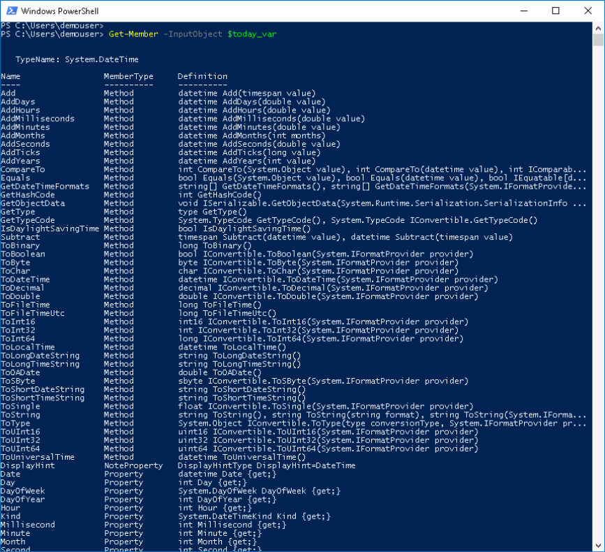

# PowerShell Introduction

This lab is an brief introduction to Microsoft PowerShell.

# Objectives

Completion Time: 15 minutes

  - How PowerShell is different than a CLI or shell script
  - Examine PowerShell Variables and Objects
  - Overview of PowerShell Verb-Noun naming style

# Prerequisites

Showing up is the biggest prerequisite and also running Windows. Actually that isn't true anymore, PowerShell can run on Linux, and macOS, not every PowerShell module from every vendor can run on Linux but it's getting there! However for this lab we'll be sticking with Windows.

# Product

PowerShell is made by Microsoft, the source code is available on [github](https://github.com/powershell/powershell) and open to community contributions.

The items covered in this lab and other PowerShell focused labs are greatly influenced by this [PowerShell Scripting](https://msdn.microsoft.com/en-us/powershell/scripting/powershell-scripting) content on the [MicroSoft Developer Network](https://msdn.microsoft.com/en-us/default.aspx)

# Step 1

How is PowerShell different from a typical CLI or shell script?

From the MSDN Site:

  - Unlike most shells, which accept and return text, Windows PowerShell is built on top of the .NET Framework common language runtime (CLR) and the .NET Framework, and **accepts and returns .NET Framework objects**. This fundamental change in the environment brings entirely new tools and methods to the management and configuration of Windows.

Whoa that's a big deal, do you have to know what the **.NET CLR** is or what the **.NET Framework** is to use PowerShell? No. Just remember that PowerShell returns objects. What's an Object, you ask. Think about a pair of programmable six-sided dice, each die is an object and those die have properties and methods.

**Dice Objects**:

  

  

- **Die properties**
  - Number of sides
  - Number of dots per side

- **Die methods**
  - do-roll()
  - get-side-up()
  - get-dots()
  - get-stats()

In the PowerShell terminology the **Object Properties** and **Object Methods</trong> together are known as **Object Members**.

Let's take a look at an object and it's members, through some exercises.

This lab utilizes the Windows environment for execution of the exercises.

### Exercise 1

Retrieve a PowerShell object, inspect its Properties and Methods.

Microsoft provides two interfaces for PowerShell, the PowerShell Console and the PowerShell Integrated Scripting Environment (ISE). We'll start with the PowerShell Console.

  1. Open up the PowerShell Console, by ***double-clicking*** the desktop shortcut.

  PowerShell Desktop Shortcut:

    

    

  2. At the prompt type:

    - `Get-Date`

   A date is returned in a default format.

  Get-Date Output:

    

    

  PowerShell is case **in-sensitive** so `get-date` would have worked as well.

  The date output is the default format and looks like a date, but there really was an object there. Let's try again but this time save the object returned by **Get-Date** into a PowerShell variable.  

  3. At the prompt type:

    - `$today_var = Get-Date`

   If all went well **nothing** happened... or did something happen? The `Get-Date` object is now stored in the `$today_var` variable.  

  4. At the prompt type:

    - `$today_var`

   Get-Date and $today_var Output:

    

    

  The date printed out in the default format.

  If you are at all familiar with scripting/programming you might be thinking that the character string is what is in the variable `$today_var`, that wouldn't be an unrealistic thought. However that is not the case, let's inspect the data object stored in `$today_var`  

  5. At the prompt type:

    - `Get-Member -InputObject $today_var`

   Get-Member Output:

    

    

  Turns out the `$today_var` date object has a lot of properties and methods.

  If the value retuned from `Get-Date` was just a string we would have to send it to some other script/program to convert it to something else, but because it is an object with many methods and properties we can take the `$today_var` date object and utilize it in several different ways.

  Everything in PowerShell is an object, even if it is just a string that **your** script outputs, it is a **string object**

  We'll access different properties and methods of the `Get-Date` object in the next step.

  Next Step: PowerShell Object Member Access
