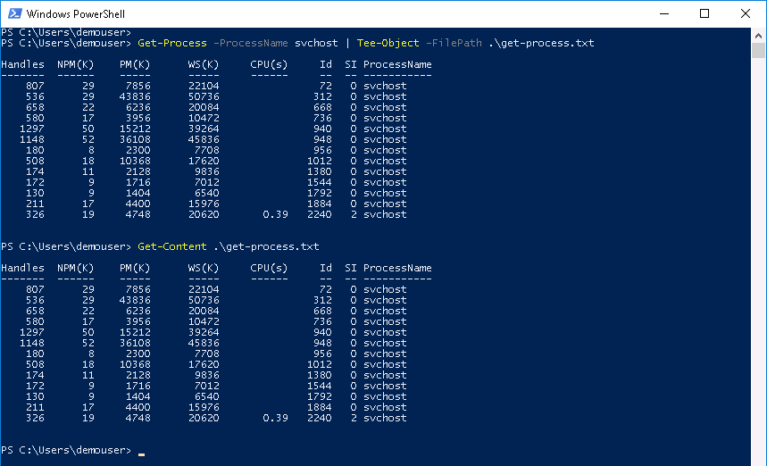

# Mission: Introduction to PowerShell - Basic Mission

# Step 4

### Exercise 3 - Solution

  1. At the prompt type:

    - `Get-Process -ProcessName svchost | Tee-Object -FilePath .\get-process.txt`

  View the file.  

  2. At the prompt type:

    - `Get-Content .\get-process.txt`

  Get-Process - Tee-Object - Get-Content Cmdlets Output:

  <!--  -->

    

Congratulations you have completed the Basic Mission for Introduction to PowerShell. If you want to try your PowerShell skills at something a little trickier, try the Introduction to PowerShell Advanced Mission.
