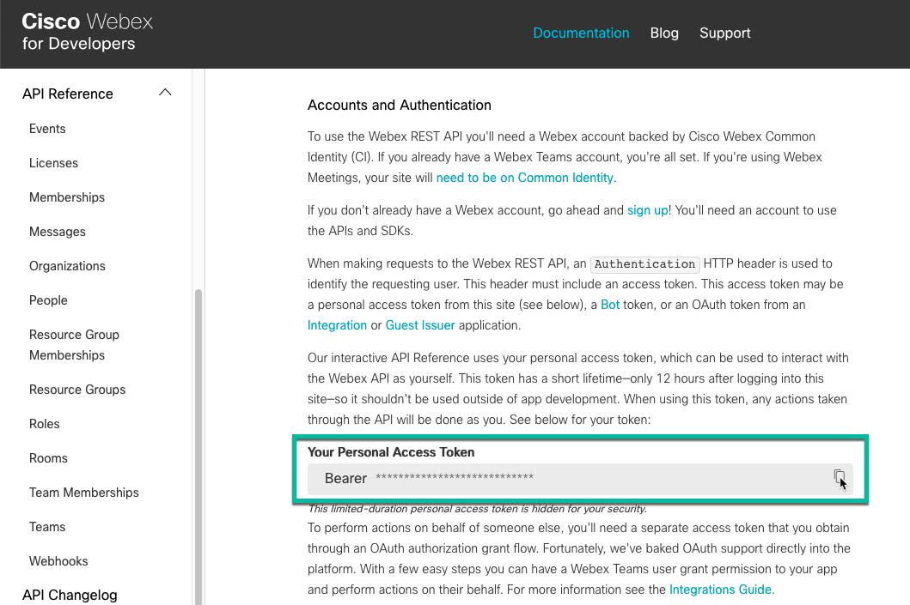
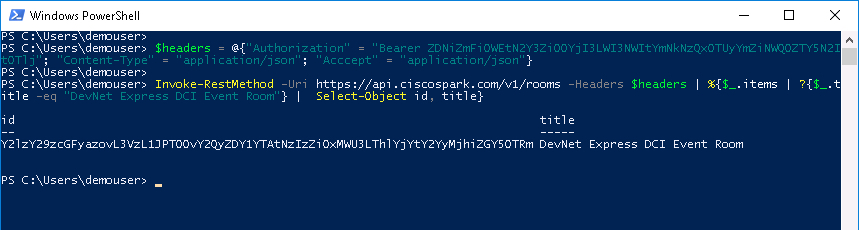
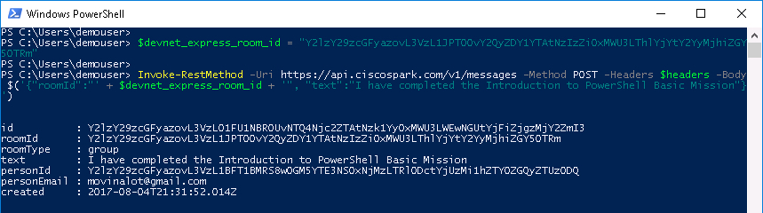
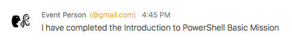
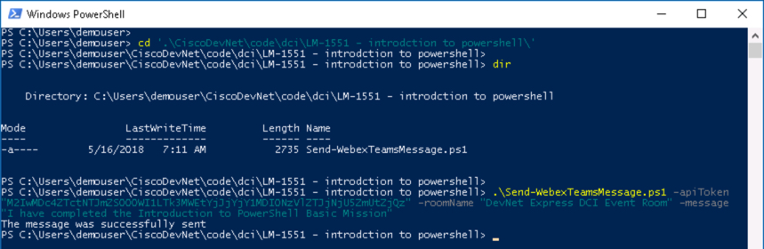

# Mission: Introduction to PowerShell - Basic Mission

### Exercise 3 - Solution

1. At the prompt type:

  ```PowerShell
  Get-Process -ProcessName svchost | Tee-Object -FilePath .\get-process.txt
  ```

  View the file.</br></br>

2. At the prompt type:

  ```PowerShell
  Get-Content .\get-process.txt
  ```

  Get-Process - Tee-Object - Get-Content Cmdlets Output:

  <br/><br/>

### Mission Completion

Update the **DevNet Express** event **Webex Teams Space** with a ***Mission Completion Message***

1. Retrieve your **Webex Teams**, formerly Cisco Spark, API Token. The token is used to authenticate and access the Webex Teams APIs.

  - Login to the [Cisco Webex for Developers site](https://developer.webex.com)
  - Midway down the "[Getting Started](https://developer.webex.com/getting-started.html#authentication)" page under the **Authentication** section, your current API authentication token will be available for copying.
  - ***Click*** **Copy** to copy your access token to the clipboard<br/><br/>

    <br/><br>

2. Ensure that the PowerShell session is set to use the correct TLS/SSL settings for communicating with the Webex Teams APIs by running this command.

  ```PowerShell
  [System.Net.ServicePointManager]::SecurityProtocol = [System.Net.SecurityProtocolType]::Ssl3 -bor [System.Net.SecurityProtocolType]::Tls -bor [System.Net.SecurityProtocolType]::Tls11 -bor [System.Net.SecurityProtocolType]::Tls12
  ```

3. Use the PowerShell `Invoke-RestMethod` Cmdlet to Retrieve the DevNet Express Event Room Id

  - Webex Teams has a REST API to retrieve all the Rooms that to which you are subscribed. To execute the API through the PowerShell `Invoke-RestMethod` Cmdlet you will need to send your Access Token in the header of the request using a [PowerShell hash table construct](https://docs.microsoft.com/en-us/powershell/module/Microsoft.PowerShell.Core/about_Hash_Tables?view=powershell-5.1).
  - A PowerShell hash table is a common programming construct know as an [*Associative Array*](https://en.wikipedia.org/wiki/Comparison_of_programming_languages_&#40;associative_array&#41;) and is similar to a Python Dictionary (dict). The elements of a hash table are ***Key/Value*** pairs. Set these values in the hash table `$headers` (this is an arbitrary variable name, you could have used any name).

    - **Authorization** - The value is ***your*** API Token, prefixed by the string "**Bearer** "
    - **Content-Type** - The value is **application/json** - This indicates the format of request data (if any).
    - **Accept** - The value is **application/json** - This indicates the **requested** format of response data (if any).</br></br>

    ```PowerShell
    $headers = @{"Authorization" = "Bearer <your-api-token>"; "Content-Type" = "application/json"; "Accept" = "application/json"}
    ```

  - Use the Webex Teams Rooms API and find the DevNet Express Event Room. In this example the room name is **"DevNet Express DCI Event Room"**. The Webex Teams Rooms API will return a JSON construct that PowerShell will put into an array of hash tables, one hash table for each room. The array is named **items**
  
    - The Webex Teams Rooms API Uri is https://api.ciscospark.com/v1/rooms</br></br>
    - The Rooms API returns a maximum of 100 entries at a time. Because Webex Teams has become widely used you may actually belong to more than 100 spaces and would need to make more API calls to find the room id, this is know as [Response Pagination](https://developer.webex.com/pagination.html).
    - Instead we'll increase the returned number of rooms by adding a query modification parameter to the end of the Uri to increase the entries returned to 1000.

    ```PowerShell
    Invoke-RestMethod -Uri https://api.ciscospark.com/v1/rooms?max=1000 -Headers $headers | %{$_.items | ?{$_.title -eq "DevNet Express DCI Event Room"} |  Select-Object id, title}
    ```

    - The default HTTP *method* for `Invoke-RestMethod` is **GET** and does not need to be specified.
    - The results of the `Invoke-RestMethod` Cmdlet are pipelined to a `ForEach-Object` Cmdlet
    - Each Object is pipelined to a `Where-Object` Cmdlet
    - When the hash table entry with a `title` key that has a `value` that matches the Room name, the `title` and `id` values from the hash table are displayed.<br/><br/>

    <br/><br/>

4. Post the message "I have completed the Introduction to PowerShell Basic Mission" to the DevNet Express Event Room

  - Webex Teams has a REST API to send Messages. To execute the API through the PowerShell `Invoke-RestMethod` Cmdlet you will need to send your Access Token in the header of the request, as well the Messages API requires the message and the destination Room Id in JSON format.
  - The Webex Teams Messages API Uri is https://api.ciscospark.com/v1/messages

    ```PowerShell
    $devnet_express_room_id = "Y2lzY29zcGFyazovL3VzL1JPT00vY2QyZDY1YTAtNzIzZi0xMWU3LThlYjYtY2YyMjhiZGY5OTRm"

    Invoke-RestMethod -Uri https://api.ciscospark.com/v1/messages -Method POST -Headers $headers -Body $('{"roomId":"' + $devnet_express_room_id + '", "text":"I have completed the Introduction to PowerShell Basic Mission"}')
    ```

    - The **POST** method was specified for `Invoke-RestMethod`
    - The **Body** JSON was specified
    - The **Body** JSON is evaluated first by utilizing the `$()` construct in PowerShell<br/><br/>

    <br/><br/>

5. View your message in the DevNet Express Event Room.

  <br/><br/>

### Mission Completion - Quick Mode

  Run the PowerShell Script `Send-WebexTeamsMessage.ps1`

1. Change to the directory "C:\Users\demouser\CiscoDevNet\code\dci\LM-1551 - introduction to powershell"

2. Run the `Send-WebexTeamsMessage.ps1` Cmdlet, specify the following parameters:

  - -apiToken - The value is your API Token in double quotes
  - -roomName - The value is the name of the Spark Room to send the message to in double quotes
  - -message - The value is the message in double quotes

  ```PowerShell
  .\Send-WebexTeamsMessage.ps1 -apiToken "M2IwMDc4ZTctNTJmZS00OWI1LTk3MWEtYjJjYjY1MDI0NzVlZTJjNjU5ZmUtZjQz" -roomName "DevNet Express DCI Event Room" -message "I have completed the Introduction to PowerShell Basic Mission"
  ```

  <br/><br/>

Congratulations you have completed the Basic Mission for Introduction to PowerShell. If you want to try your PowerShell skills at something a little trickier, try the Introduction to PowerShell Advanced Mission.
