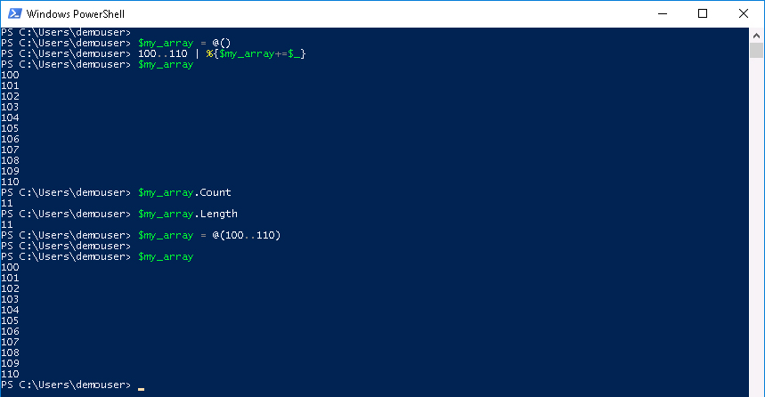

# Mission: Introduction to PowerShell - Advanced Mission

# Step 2

### Exercise 1 - Solutions

  1. At the prompt type:

    - `$my_array = @()`
    - `100..110 | %{$my_array+=$_}`
    - `$my_array`
    - `$my_array.Count`
    - `$my_array.Length`

  Another way to create the array

    - `$my_array = @(100..110)`

  PowerShell Array Creation:

    

    

# Step 2: Create a PowerShell Array with the letters A-Z and a-z

### Exercise 2

  1. Use the Range Operator **..** to create an array containing A-Z and a-z, name the array `$my_array`

    - To Complete this exercise task you'll need to **cast** the Integer type to a **[char]**, the ASCII integers for A-Z are 65-90, the integers for a-z are 97-122.

  2. Write `$my_array` to the console separating each letter with a comma. Precede the array display with a blank line and follow it with a blank line.

    - To complete this task you'll need to use the `Write-Host` Cmdlet with the `-Separator` parameter.

  3. Could task one be done more than one way?

Go to the next page for the solution...
