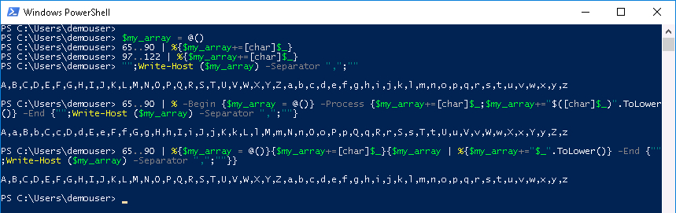

# Mission: Introduction to PowerShell - Advanced Mission

### Exercise 2 - Solutions

  1. At the prompt type:

    - `$my_array = @()`
    - `65..90 | %{$my_array+=[char]$_}`
    - `97..122 | %{$my_array+=[char]$_}`
    - `"";Write-Host ($my_array) -Separator ",";""`

  Another way to create the array in a single line, using only the ASCII integers for A-Z is

    - `65..90 | % -Begin {$my_array = @()} -Process {$my_array+=[char]$_;$my_array+="$([char]$_)".ToLower()} -End {"";Write-Host ($my_array) -Separator ",";""}`

  PowerShell Array Creation Advanced:

  <!--  -->

    

  An explanation is in order for the second solution.

    - The ASCII character codes for A-Z are 65-90. Using the range operator, each integer object is sent down the pipeline.

    - The `ForEach-Object` Cmdlet, aliased as **%**, has the ability to process **Begin**, **Process**, and **End** blocks.

      - **Begin** block code is run once ***before*** the first object is processed.

      - **Process** block code is run for ***every*** object.

      - **End** block code is run once ***after*** all the objects have been processed.

      - The `-Begin`, `-Process`, and `-End` are not required, if omitted **Code Block Precedence** is:

        - One block is a Process block.
        - Two blocks are Begin and Process blocks, in that order.
        - Three Blocks are Begin, Process, and End blocks, in that order.

    - The **Begin** block initialized `$my_array` to an empty array.

    - The **Process** block:
      - Added the [char] representation of the Integer to the array.
      - Added the lowercase [char] representation of the Integer to the array. However, the **$()** construct inside double quotes **"** was used to first cast the Integer to a character. Then the `.ToLower()` member method of the String object was used to lowercase the letter.

    - The **End** block displays `$my_array` with a blank line before and after.

  There is a slight difference in the arrays created by the two methods. Both contain all the letters A-Z and a-z. However, in the first array A-Z is followed by a-z; in the second array the pattern is A,a,B,b,C,c and so on to Z,z.

  Is there a single line method to achieve the same array as the first method? No need to figure it out, I've shown it below.

    - `65..90 | %{$my_array = @()}{$my_array+=[char]$_}{$my_array | %{$my_array+="$_".Tolower()} -End {"";Write-Host ($my_array) -Separator ",";""}}`

  In this last example the **End** block was specified because only two blocks were specified and the default is to process the blocks as **Begin** and **Process** blocks.

Congratulations you have completed the Advanced Mission for Introduction to PowerShell.
