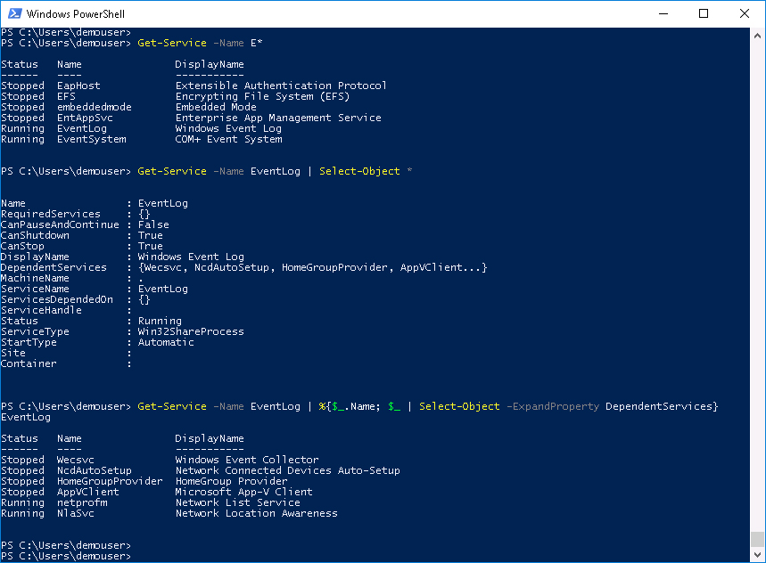
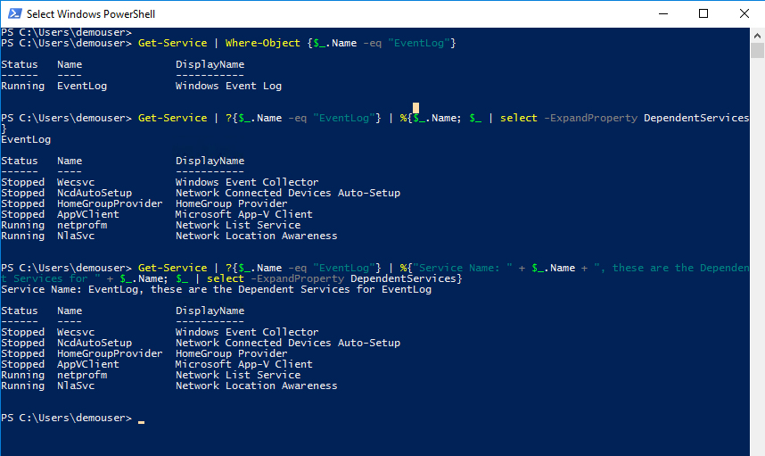

# PowerShell Pipelining and Output

This lab is a all about PowerShell Pipelining and Output.

## Objectives

Completion time: 20 minutes

  - What is the PowerShell Pipeline?
  - How to use the Pipeline
  - PowerShell Output
  - PowerShell Out-GridView

## Prerequisites

It would be great if you have gone through the <strong>PowerShell Introduction</strong> Lab. You'll need a Windows Desktop with PowerShell installed. While it is true that PowerShell will run on Linux and macOS we will not be doing any of that in this lab.

## Product

PowerShell is made by Microsoft, the source code is available on [github](https://github.com/powershell/powershell) and open to community contributions.

The items covered in this lab and other PowerShell focused labs are greatly influenced by this [PowerShell Scripting](https://msdn.microsoft.com/en-us/powershell/scripting/powershell-scripting) content on the [MicroSoft Developer Network](https://msdn.microsoft.com/en-us/default.aspx)

# Step 1

The pipeline is very common in CLIs and shells, PowerShell has it as well. However, instead of <strong>text</strong> going down the pipeline PowerShell sends objects. The pipeline in PowerShell is represented by the | character, sometimes referred to as the "pipe" or the "bar" or "that straight up-and-down thingy", ok I made up that last one.

If you have completed the labs, <strong>PowerShell Introduction</strong> and/or <strong>PowerShell Cmdlets and Objects</strong> then you used the pipe character to pass PowerShell objects down the pipeline.

The pipeline allows you to send the output of one Cmdlet as input to another Cmldet, without having to store the result of the first Cmldet in a variable.

### Exercise 1

We'll dive right into Pipelining with some examples.

  1. Open up the PowerShell Console, by <strong>*double-clicking*</strong> the desktop shortcut, if it is not already open.

  PowerShell Desktop Shortcut:

    

    

  2. At the prompt type:

    - `Get-Service -Name E*`
    - `Get-Service -Name EventLog | Select-Object *`
    - `Get-Service -Name EventLog | ForEach-Object {$_.Name; $_ | Select-Object -ExpandProperty DependentServices}`
    - `Get-Service -Name EventLog | %{$_.Name; $_ | Select-Object -ExpandProperty DependentServices}`

     Get-Service ForEach-Object Ouput:

      

      

    What did you do?

    1. Command 1 - Retrieved all the <strong>Services</strong> where the Name of the Service started with <strong>E</strong>

    2. Command 2 - Retrieved <strong>only</strong> the <strong>EventLog Service</strong> and <strong>piped</strong> the service object to the PowerShell Cmdlet `Select-Object` and displayed all the properties for the object

    3. Command 3 & 4 - Retrieved <strong>only</strong> the EventLog Service and piped the EventLog service object to the PowerShell Cmdlet `ForEach-Object` which has the alias `foreach` and the alias `%`
      - In `ForEach-Object`, you output the <strong>Name</strong> property of the pipeline object `$_` and then output all the <strong>DependentServices</strong> of the EventLog Service with the `-ExpandProperty` parameter of the `Select-Object` Cmdlet

      - This is a pipeline inside a pipeline

      - Notice in the second command that was run `Get-Service -Name EventLog | Select-Object *` the value for DependentServices was displayed within curly braces `{}` with an ellipses. That notation means that there is more than is being displayed. By indicating to `Select-Object` that the property was to be expanded all the values in the curly braces `{}` shown and not shown are displayed.

    Are you tired because that was a lot. Seriously that was a lot, or power. Suppose you wanted to know all the DependentServices of all the Services that started with <strong>E</strong>.

### Exercise 2

Find all the DependentServices of the Services that start with <strong>E</strong>.

Didn't we just do that? Yes, but let's do it a little differently than last time.

  1. At the prompt type:

    - `Get-Service | Where-Object {$_.Name -eq "EventLog"}`
    - `Get-Service | Where-Object {$_.Name -eq "EventLog"} | % {$_.Name; $_ | Select-Object -ExpandProperty DependentServices}`
    - `Get-Service | ? {$_.Name -eq "EventLog"} | %{"Service Name: " + $_.Name + ", these are the Dependent Services for " + $_.Name; $_ | select -ExpandProperty DependentServices}`

     Get-Service Where-Object Output:

      

      

    What did you do?

    1. Command 1 - Retrieved all the <strong>Services</strong> objects and piped them to the `Where-Object` Cmdlet to test if the <strong>Name</strong> of the pipeline service object equaled <strong>EventLog</strong>

    2. Command 2 - Retrieved all the Services objects and piped them to `Where-Object` then piped only the object whose Name equaled EventLog to `ForEach-Object` (but this time the aliaa `%` was used) to output the <strong>Name Property</strong> of the <strong>pipeline object</strong> and then piped the pipeline object to `Select-Object` and output the `-ExpandProperty` DependentServices.

    3. Command 3 - The same process as Command 2 however this time both `Where-Object` and `ForEach-Object` aliases were used, `?` and `%`, respectively. Also <strings>text strings</strings> were added and concatenated with the <strong>Name</strong> property.

    Pipelines allow you to chain together multiple Cmdlets and either pass the same objects down the pipeline or use the object coming down the pipeline as input to the next Cmldet, which may retrieve different objects or mutate the current object and send those objects down the pipeline. We explore that behavior in the lab, <strong>Introduction to UCS PowerTool</strong>

    All along the way we have created output, well there are things you can do with that output, write it to the host (screen), write it to a file, write it to a graphical grid with searching and filtering.

Next Step: What's up with PowerShell Output?
