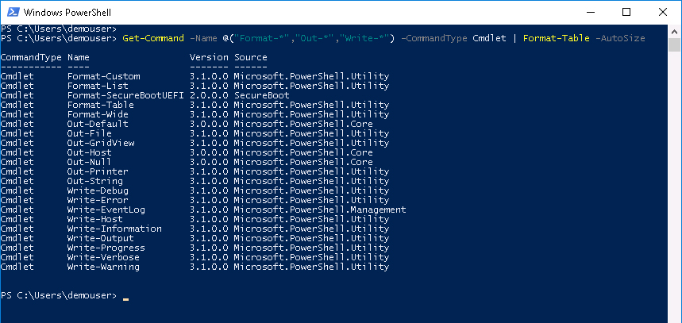
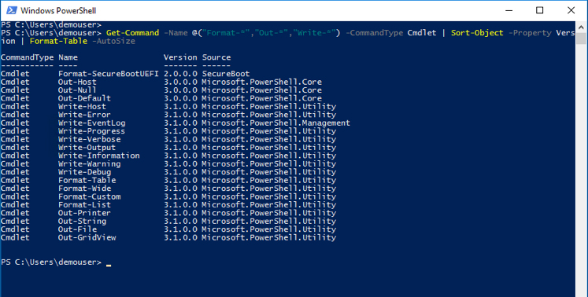
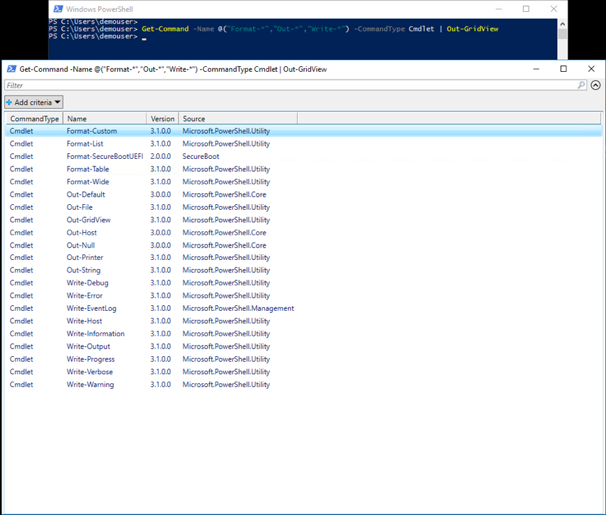
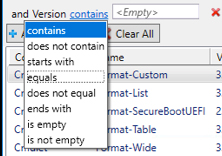

# PowerShell Pipelining and Output

# Step 2

What is PowerShell Output? There are two main ways to manage PowerShell output: with **Write** Cmdlets and with **Out** Cmdlets. As well there are **Format** Cmdlets to manage how output is formatted.

We will look at the most utilized Output Cmdlets.

### Exercise 3

List all the PowerShell Output Cmdlets

  1. At the prompt type:

    - `Get-Command -Name @("Format-*","Out-*","Write-*") -CommandType Cmdlet`

   Get-Command with Array Output:

  <!--  -->

    

  What did you do?

    1. You ran the `Get-Command` Cmdlet with an **array of String Objects** as input to the `-Name` parameter and specified that only Cmdlets should be shown using the `-CommandType` parameter with **Cmdlet** specified.

    2. You **created an array dynamically** by using the `@()` operator on a list of quoted strings. Single quotes or double quotes will work.

  If you were to run `Get-Help -Name Get-Command`, you would see that `Get-Command` can take an array of string objects as input to the `-Name` parameter.

    - `Get-Command [[-Name] <String[]>]`

      In PowerShell Cmdlet help, square brackets `[]` mean **something** is optional when they surround that **something**.

      The angle brackets `<>` indicate the Object type that can be specified for the `-Name` parameter, in this case a **String** object can be specified. Also, the `[]` brackets after the object type indicate that an **array** of those objects can be specified.

  The list came out in a nice table format, but there is a lot of space in between the columns. You really wish they were closer together.

  Let's get those columns to only be as wide as they need to be to fit the longest entry.

  2. At the prompt type:

    - `Get-Command -Name @("Format-*","Out-*","Write-*") -CommandType Cmdlet | Format-Table -AutoSize`

    Get-Command with Format-Table Output:

  <!--  -->

    

  Running the same `Get-Command` again but this time pipelining the output to `Format-Table` and adding the `-Autosize` parameter caused the output columns to only be as wide as the widest item in that column.

  `Format-Table` has the alias `ft` and supports a number of parameters. It is definitely worth running `Get-Help Format-Table` to see them all.

  Did you notice the different versions in the version column? Did you wish you could sort by version number?

### Exercise 4

Sort `Get-Command` output by the **Version** number.

  1. At the prompt type:

    - `Get-Command -Name @("Format-*","Out-*","Write-*") -CommandType Cmdlet | Sort-Object -Property Version | Format-Table -Autosize`

    Get-Command with Sort-Object Output:

  <!--  -->

    

  You can sort on any property that is part of the object in the pipeline. The `Sort-Object` Cmdlet also has a `-Unique` parameter, the thing to remember is that the uniqueness is determined by the **sorted property**. Let's see the difference in output when the `-Unique` parameter is added to the `Sort-Object` Cmdlet.

  2. At the prompt type:

    - `Get-Command -Name @("Format-*","Out-*","Write-*") -CommandType Cmdlet | Sort-Object -Property Version -Unique | Format-Table -Autosize`

   Get-Command with Sort-Object Unique Output:

  <!--  -->

    

  The result shows that the first object where the property was unique is displayed.

  Suppose you wanted to manipulate the output, filter, sort, and so on without having to rerun the Cmdlets each time. PowerShell offers a graphical output Cmdlet called `Out-GridView`. This Cmdlet offers all those capabilities.

### Exercise 5

Use `Out-GridView` to manipulate Cmdlet output.

  1. At the prompt type:

    - `Get-Command -Name @("Format-*","Out-*","Write-*") -CommandType Cmdlet | Out-GridView`

   Get-Command with Out-GridView Output:

  <!--  -->

    

  2. *Click* on the `Version` column to sort by **Version**

  3. *Click* on the `Name` column to sort by **Name**

  4. *Click* on the   button, *check* `Version` and *click* `Add`

  <!--  -->

    

  5. *Click* on the `contains` link and *click* on `equals`

  <!--  -->

    

  6. Enter `3.0.0.0` in the field next to `equals`, the result should show just Cmdlets with a **Version** of `3.0.0.0`

  <!--  -->

    

  `Out-GridView` enables you to manipulate and work with data that is the result of one or more Cmdlets. You can add/remove columns from the display and add/remove criteria. Whether you use it as a development tool to find the right sort and filter criteria for your objects or to make a decision on the spot, be sure to remember the **Power** of `Out-GridView`.

  Just *click* the `X` in the upper right corner to close the `Out-GridView` window.

Next Step: Write to the Host and Write to a File
