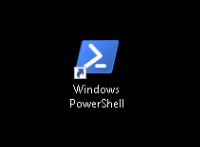

# PowerShell Introduction

This lab is an brief introduction to Microsoft PowerShell.

# Objectives

Completion Time: 20 minutes

  - How PowerShell is different than a CLI or shell script
  - Examine PowerShell Variables and Objects
  - Overview of PowerShell Verb-Noun naming style

# Prerequisites

Showing up is the biggest prerequisite and also running Windows. Actually that isn't true anymore, PowerShell can run on Linux, and macOS, not every PowerShell module from every vendor but it's getting there!

# Product

PowerShell is made by Microsoft, the source code is available on [github](https://github.com/powershell/powershell) and open to community contributions.

The items covered in this lab and other PowerShell focused labs are greatly influenced by this [PowerShell Scripting](https://msdn.microsoft.com/en-us/powershell/scripting/powershell-scripting) content on the [MicroSoft Developer Network](https://msdn.microsoft.com/en-us/default.aspx)

# Step 1

How is PowerShell different from a typical CLI or shell script?

From the MSDN Site:

  - Unlike most shells, which accept and return text, Windows PowerShell is built on top of the .NET Framework common language runtime (CLR) and the .NET Framework, and accepts and returns .NET Framework objects. This fundamental change in the environment brings entirely new tools and methods to the management and configuration of Windows.

Whoa that's a big deal, do

Do you have to know what the **.NET CLR** is or what the **.NET Framework** is to use PowerShell? No.

Just remember that PowerShell returns objects. What's an Object, you ask.

Think about a pair of programmable six-sided dice, each die is an object and those die have properties.

Dice Objects:

<br/><br/>

<br/><br/>

- Die properties
  - Number of sides
  - Number of dots per side

Those die have methods.

- Die methods
  - do-roll()
  - get-side-up()
  - get-dots()
  - get-stats()

In the PowerShell terminology the **Object Properties** and **Object Methods** together are known as **Object Members**.

Let's take a look at an object and it's members, through some exercises.

This lab utilizes the Windows environment for execution of the exercises.

### Exercise 1

Retrieve a PowerShell object inspect it's Properties and Methods. Microsoft provides two interfaces for PowerShell, the PowerShell Console and the PowerShell Integrated Scripting Environment (ISE). We'll start with the PowerShell Console.

  1. Open up the PowerShell Console, by ***double-clicking*** the desktop shortcut.

  PowerShell Desktop Shortcut:

  <br/><br/>

  <br/><br/>

  2. At the prompt type:

    - `Get-Date`

  </br>A date is returned in a default format.

  Get-Date Output:

  <br/><br/>

  <br/><br/>

  PowerShell is case **in**-sensitive so `get-date` would have worked as well.

  The date output is the default format and looks like a date, but there really was an object there... Let's try again but this time save the object returned by **Get-Date** into a PowerShell variable.

  3. At the prompt type:

    - `$today_var = Get-Date` and enter

  </br>If all went well **nothing** happened, or did something happen. The `Get-Date` object is now stored in the `$today_var` variable.

  4. At the prompt type:

    - `$today_var`

  <br>Get-Date and $today_var Output:

  <br/><br/>

  <br/><br/>

  The date printed out in the default format.

  If you are at all familiar with scripting/programming you might be thinking that the character string is what is in the variable `$today_var`, that wouldn't be an unrealistic thought. However that is not the case, let's inspect the data object stored in `$today_var`

  5. At the prompt type:

    - `Get-Member -InputObject $today_var`

  </br>Get-Member Output:

  <br/><br/>

  <br/><br/>

  Turns out the `$today_var` date object has a lot of properties and methods.

  Here's the entire list.

  ```csharp
  TypeName: System.DateTime

  Name                 MemberType     Definition
  ----                 ----------     ----------
  Add                  Method         datetime Add(timespan value)
  AddDays              Method         datetime AddDays(double value)
  AddHours             Method         datetime AddHours(double value)
  AddMilliseconds      Method         datetime AddMilliseconds(double value)
  AddMinutes           Method         datetime AddMinutes(double value)
  AddMonths            Method         datetime AddMonths(int months)
  AddSeconds           Method         datetime AddSeconds(double value)
  AddTicks             Method         datetime AddTicks(long value)
  AddYears             Method         datetime AddYears(int value)
  CompareTo            Method         int CompareTo(System.Object value), int CompareTo(datetime value), int
                                     IComparable.CompareTo(System.Object obj), int
                                     IComparable[datetime].CompareTo(datetime other)
  Equals               Method         bool Equals(System.Object value), bool Equals(datetime value), bool
                                     IEquatable[datetime].Equals(datetime other)
  GetDateTimeFormats   Method         string[] GetDateTimeFormats(), string[] GetDateTimeFormats(System.IFormatProvider
                                     provider), string[] GetDateTimeFormats(char format), string[]
                                     GetDateTimeFormats(char format, System.IFormatProvider provider)
  GetHashCode          Method         int GetHashCode()
  GetObjectData        Method         void ISerializable.GetObjectData(System.Runtime.Serialization.SerializationInfo
                                     info, System.Runtime.Serialization.StreamingContext context)
  GetType              Method         type GetType()
  GetTypeCode          Method         System.TypeCode GetTypeCode(), System.TypeCode IConvertible.GetTypeCode()
  IsDaylightSavingTime Method         bool IsDaylightSavingTime()
  Subtract             Method         timespan Subtract(datetime value), datetime Subtract(timespan value)
  ToBinary             Method         long ToBinary()
  ToBoolean            Method         bool IConvertible.ToBoolean(System.IFormatProvider provider)
  ToByte               Method         byte IConvertible.ToByte(System.IFormatProvider provider)
  ToChar               Method         char IConvertible.ToChar(System.IFormatProvider provider)
  ToDateTime           Method         datetime IConvertible.ToDateTime(System.IFormatProvider provider)
  ToDecimal            Method         decimal IConvertible.ToDecimal(System.IFormatProvider provider)
  ToDouble             Method         double IConvertible.ToDouble(System.IFormatProvider provider)
  ToFileTime           Method         long ToFileTime()
  ToFileTimeUtc        Method         long ToFileTimeUtc()
  ToInt16              Method         int16 IConvertible.ToInt16(System.IFormatProvider provider)
  ToInt32              Method         int IConvertible.ToInt32(System.IFormatProvider provider)
  ToInt64              Method         long IConvertible.ToInt64(System.IFormatProvider provider)
  ToLocalTime          Method         datetime ToLocalTime()
  ToLongDateString     Method         string ToLongDateString()
  ToLongTimeString     Method         string ToLongTimeString()
  ToOADate             Method         double ToOADate()
  ToSByte              Method         sbyte IConvertible.ToSByte(System.IFormatProvider provider)
  ToShortDateString    Method         string ToShortDateString()
  ToShortTimeString    Method         string ToShortTimeString()
  ToSingle             Method         float IConvertible.ToSingle(System.IFormatProvider provider)
  ToString             Method         string ToString(), string ToString(string format), string
                                     ToString(System.IFormatProvider provider), string ToString(string format,
                                     System.IFormatProvider provider), string IFormattable.ToString(string format,
                                     System.IFormatProvider formatProvider), string
                                     IConvertible.ToString(System.IFormatProvider provider)
  ToType               Method         System.Object IConvertible.ToType(type conversionType, System.IFormatProvider
                                     provider)
  ToUInt16             Method         uint16 IConvertible.ToUInt16(System.IFormatProvider provider)
  ToUInt32             Method         uint32 IConvertible.ToUInt32(System.IFormatProvider provider)
  ToUInt64             Method         uint64 IConvertible.ToUInt64(System.IFormatProvider provider)
  ToUniversalTime      Method         datetime ToUniversalTime()
  DisplayHint          NoteProperty   DisplayHintType DisplayHint=DateTime
  Date                 Property       datetime Date {get;}
  Day                  Property       int Day {get;}
  DayOfWeek            Property       System.DayOfWeek DayOfWeek {get;}
  DayOfYear            Property       int DayOfYear {get;}
  Hour                 Property       int Hour {get;}
  Kind                 Property       System.DateTimeKind Kind {get;}
  Millisecond          Property       int Millisecond {get;}
  Minute               Property       int Minute {get;}
  Month                Property       int Month {get;}
  Second               Property       int Second {get;}
  Ticks                Property       long Ticks {get;}
  TimeOfDay            Property       timespan TimeOfDay {get;}
  Year                 Property       int Year {get;}
  DateTime             ScriptProperty System.Object DateTime {get=if ((& { Set-StrictMode -Version 1; $this.DisplayHint
                                     }) -ieq  "Date")
                                               {
                                               "{0}" -f $this.ToLongDateString()
                                               }
                                               elseif ((& { Set-StrictMode -Version 1; $this.DisplayHint }) -ieq "Time")
                                               {
                                               "{0}" -f  $this.ToLongTimeString()
                                               }
                                               else
                                               {
                                               "{0} {1}" -f $this.ToLongDateString(), $this.ToLongTimeString()
                                               };}

  ```

  If the value retuned from `Get-Date` was just a string we would have to send it to some other script/program to convert it to something else, but because it is an object with many methods and properties we can take the `$today_var` date object and utilize it in several different ways.

  Everything in PowerShell is an object, even if it is just a string that **your** script outputs, it is a **string object**

  We'll access different properties and methods of the `Get-Date` object in the next step.

  Next Step: PowerShell Object Member Access
